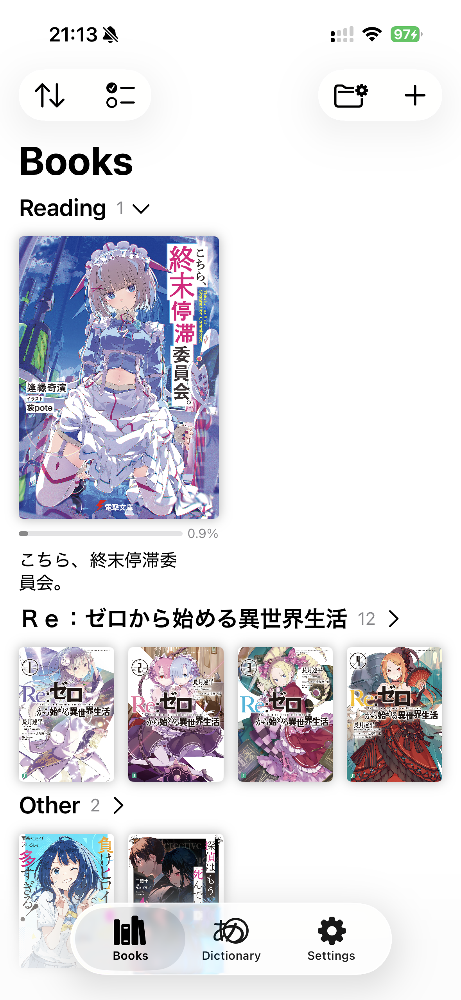
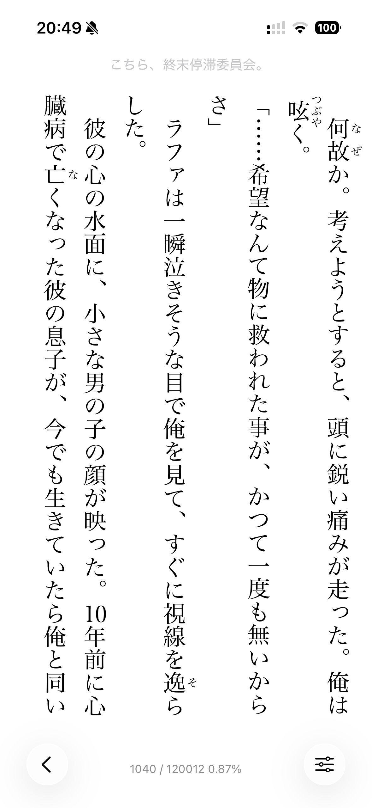
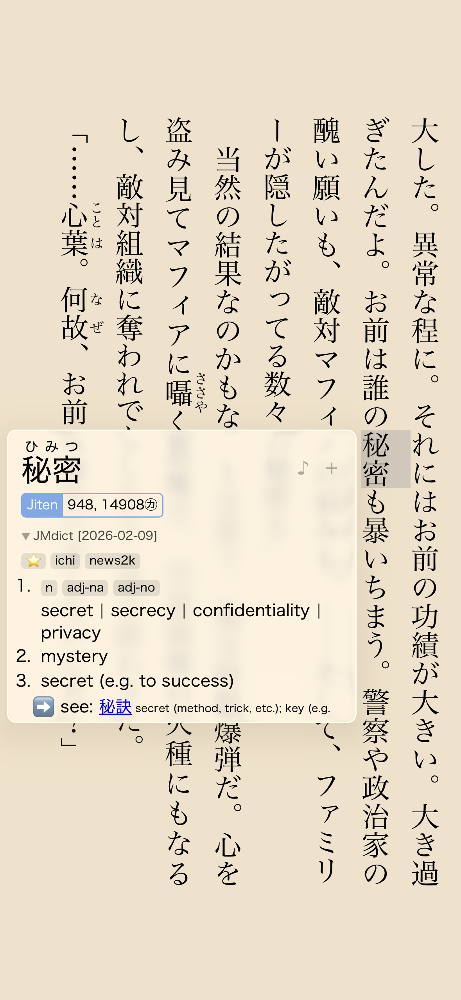
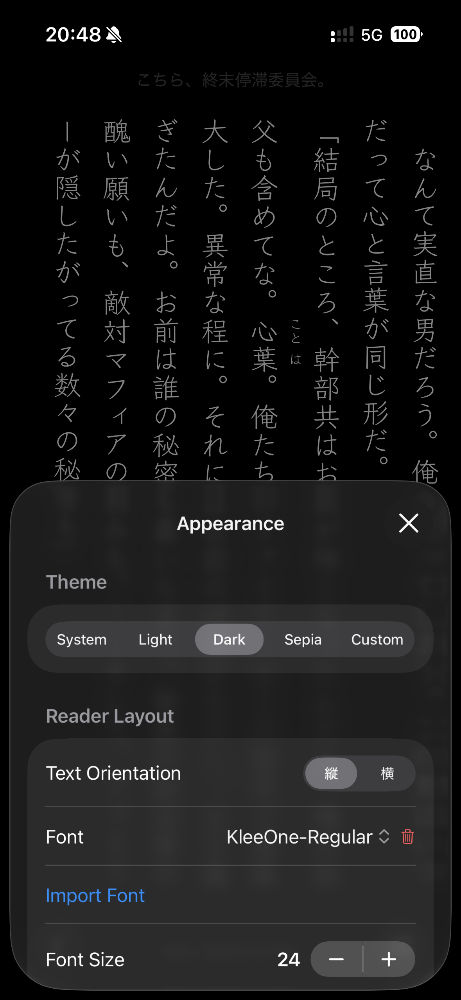
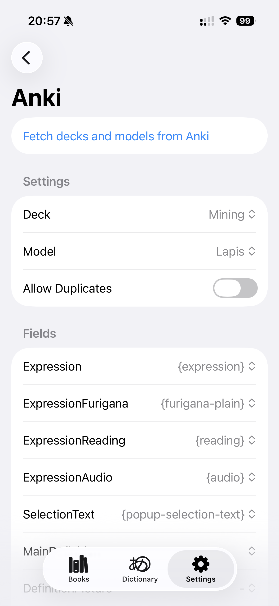

# Hoshi Reader

A lightweight Japanese EPUB reader designed for iOS 26 with Yomitan dictionary support

    
    
    
    
    
    

## Download

## Features

- **Vertical** (縦書き) and horizontal (横書き) text
- Yomitan-like pop-up dictionary with **deinflection support**
- Support for **all** Yomitan term, frequency and pitch dictionaries
- **Audio support** for Yomitan online and **local audio** sources made for Ankiconnect Android
- **AnkiMobile integration** with one-click mining
- Support for all core handlebars used by [Lapis](https://github.com/donkuri/lapis)
- **ッツ Reader sync**
- **Reading statistics**
- Dictionary search
- Bookshelves
- Custom themes, fonts and css

## Development

1. Clone the repository.
2. Open `HoshiReader.xcodeproj` in Xcode.

## Libraries

| Name | License |
| :--- | :--- |
| [yomitandicts-cpp](https://github.com/Manhhao/yomitandicts-cpp) | GPLv3 |
| [EPUBKit](https://github.com/witekbobrowski/EPUBKit) | MIT |
| [SwiftUI Introspect](https://github.com/siteline/swiftui-introspect) | MIT |

## Attribution

| Name | Description | License |
| :--- | :--- | :--- |
| [Ankiconnect Android](https://github.com/KamWithK/AnkiconnectAndroid) | Local Audio implementation | GPLv3 |
| [Yomitan](https://github.com/yomidevs/yomitan) | Pitch accent implementation, Furigana Segmenter | GPLv3 |
| [ッツ Ebook Reader](https://github.com/ttu-ttu/ebook-reader) | Statistics | BSD-3 |
| [JMdict for Yomitan](https://github.com/yomidevs/jmdict-yomitan) | Recommended term dictionary | MIT |
| [Jiten](https://github.com/Sirush/Jiten) | Recommended frequency dictionary | Apache-2.0 |
| [Kanji alive](https://github.com/kanjialive/kanji-data-media) | Default audio source | CC-BY-4.0 |
| [Tofugu/WaniKani Audio](https://github.com/tofugu/japanese-vocabulary-pronunciation-audio) | Default audio source | CC-BY-SA-4.0 |

## Issues

Please open an issue [here](https://github.com/Manhhao/Hoshi-Reader/issues) or in the TMW thread.

## Special Thanks

* **[TheMoeWay](https://learnjapanese.moe/)** - Enabling me to start learning real Japanese through immersion.
* **[Yomitan](https://github.com/yomidevs/yomitan)** - For serving as an invaluable tool and the primary inspiration for the pop-up dictionary.
* **[Ankiconnect Android](https://github.com/KamWithK/AnkiconnectAndroid)** - For providing a great mining experience on Android, which this project aims to replicate.
* **[ッツ Ebook Reader](https://github.com/ttu-ttu/ebook-reader)** - Inspiring the core reading experience.
* **[星街すいせい (Hoshimachi Suisei)](https://www.youtube.com/@HoshimachiSuisei)** - For being my motivation behind learning Japanese and giving the project a name (星読み).

## License

Distributed under the GNU General Public License v3.0. See [LICENSE](LICENSE) for more information.
