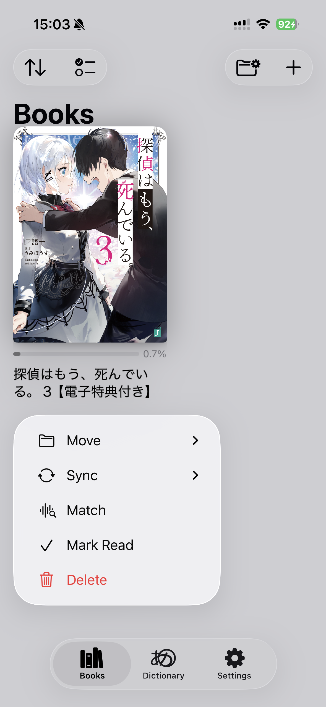
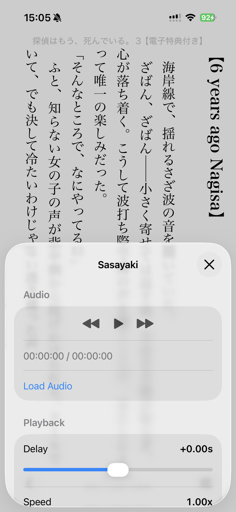
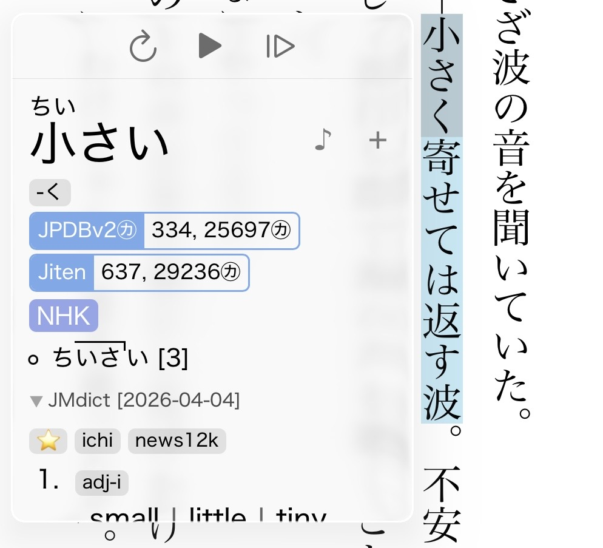

# Sasayaki

Sasayaki syncs audiobooks with the text in your books, enabling you to read along while listening.

https://github.com/user-attachments/assets/05242229-b434-40dc-b72f-09d6727b599c

## Matching

You'll need three things:
- An **audiobook** file (`.mp3` or `.m4b`)
- An **.srt** file generated by [SubPlz](https://github.com/kanjieater/SubPlz)
- Matching **.epub** file

Go to Settings -> Advanced -> Sasayaki to enable the feature.

Long press the imported epub and select `Match`.

Select the `.srt` and press Match. A match rate is shown, you should expect around 98%. 
If the match rate is low you will have to increase the search window. 
Decreasing the window might give you a slightly better rate if you already have a good match. 
Please try to use the same `.epub` as the one that was used to generate the srt file.

## Playing an audiobook

After matching a book, a new `Sasayaki` option will show up in the context menu.

Select your audiobook file and press play. The file location is persisted so the audiobook automatically loads the next time you open the reader. 
You can adjust the delay and playback speed, these are saved per book.

You will see a few additional controls when you open a popup. These will only show if the selection is part of a matched cue. Opening a popup will automatically pause playback.

- **↻** Replay line
- **▶/⏸** Play/pause
- **|▷** Resume playback from line

## Mining

Audio from the audiobook can be added to Anki cards using the `{sasayaki-audio}` handlebar. This will try to expand the cue to the sentence, which may work better or worse depending on how the cues are laid out in the `.srt` file.

## Syncing to ッツ

If you have ッツ Sync setup, enable the option in settings to sync playback positions with [ttu-whispersync](https://github.com/Renji-XD/ttu-whispersync).